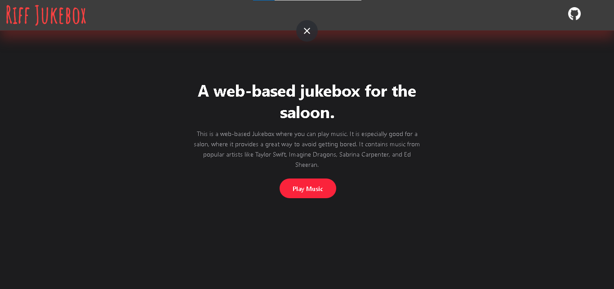
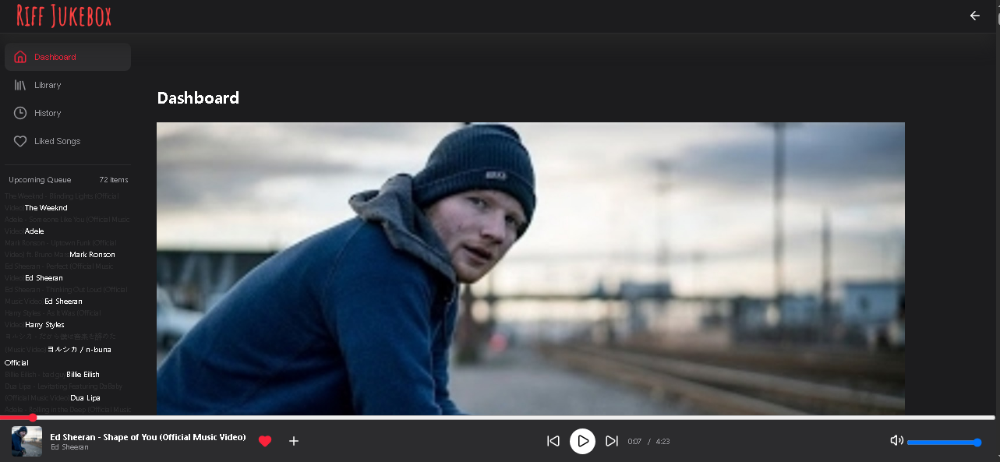

## About

**Riff Jukebox** is a music player for salon, but you can also listen song on it, without ads.

Just vist: **https://riff-drab.vercel.app/**

## Features

1. You can listen any popular music.

2. You can **Like** any music and it will saved in your brower cache.

3. You can also like add song in your library, and it will also store in browser cache.

4. And it also have history, so if you forgot to like any music, and after few times, you brain says "That was nice music", then you can see your history.

## Screenshots




## Details

It is very easy to make, you must have a database to store your music, **If you are a hackclubber, then you can use ```cdn.hackclub.com``` as database**. If you have storage then, make the UI and write the logic for it, and after that your muisc player get ready.


## How can you run locally

First, clone this repo

```git clone https://github.com/ThisShivaKaushal/Riff```

Second, go to the Project Folder

```cd Riff```

Third, open 

```Index.html```

Forth, click on play music butto, to redirect on ```music.html```

## How do I get Idea

This is a challenge give by **Pixl**, a **Hackclub**, YSWS.


## Problem 

It has some limited amount of music, that is store in ```cdn.hackclub.com```.

## Credit

A lot of thank you to **Hackclub** for providing tools like ```cdn.hackclub.com```, this makes possible to store music.

And also a lot of thank you to **PIXL** for motivating us to make projects like that.
